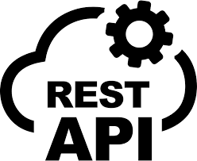

## About me

Hi there, I'm Ann.

I live in Vienna, Austria, and worked as a freelance web developer before joining a creative agency.
During this time, I developed a strong interest in full-stack web development and upskilled in the PERN stack.

Here you can take a look at my recent projects.

### My tech stack

                     

### My hobbies

🧘‍♀️ yoga

🚵‍♀️ cycling

🌹 gardening

🏞 traveling

📚 reading
